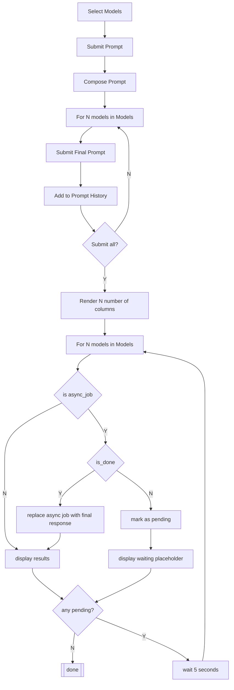

# Multi-Model Chat using Snowpark Async

Submits prompts to multiple LLMs using Streamlit Chat Widgets, Snowflake's Complete function through Snowpark Async Methods.


## Deployment Option 1:

Create Streamlit app using Snowsight and replace default app code with code from `streamlit_app.py` file. Include packages using package picker in SiS UI. 

## Deployment Option 2:

1- Create a Snowflake Stage with Directory enabled. 
```sql
CREATE OR REPLACE STAGE DB.ST_APPS.STAGE_NAME
DIRECTORY=(ENABLE=TRUE);
```
2- Upload the `streamli_app.py` and `environment.yml` files into the root of the stage. 

3- Create Streamlit app using the code below. 
```sql
CREATE STREAMLIT ASYNC_MULTI_MODEL_CHAT
  ROOT_LOCATION = '@DB.ST_APPS.STAGE_NAME'
  MAIN_FILE = 'streamlit_app.py'
  QUERY_WAREHOUSE = STREAMLIT_XS;
```

## Basic Process:

